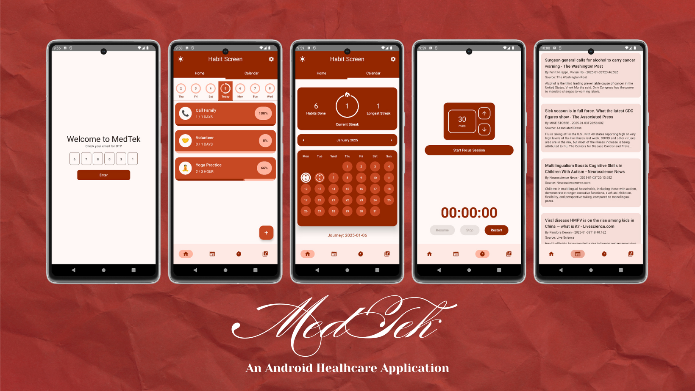
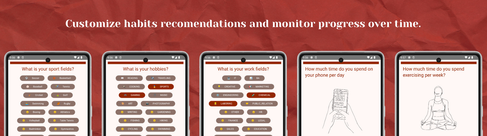
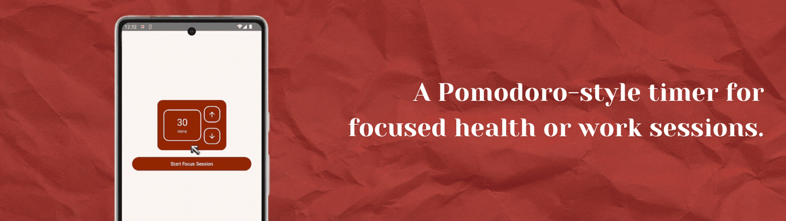

<h1 align="center"> 🚑 Medtek: Your Health Companion</h1>



[](https://kotlinlang.org/)
[](https://developer.android.com/jetpack/compose)
[](https://gradle.org/)

## 🚀 About
**Medtek** is an all-in-one health application designed to help you build and maintain healthy habits. It's a productivity and health-focused Android app created with Kotlin and Jetpack Compose, showcasing modern Android development practices.

## 🌟 Features
### 🏃 Habit Tracking
- Core feature to track your daily health habits.
- Personalize your habits and track your progress over time.
  


### 🎵 Music Player
- Integrated music player for relaxation and focus.
- Play curated health-oriented playlists.

### 🔑 Login & OTP Verification
- Secure login system with OTP verification via email.
- Simplified account creation and management.


### 📰 Health News
- Stay updated with the latest health and wellness news.
- Personalized recommendations based on your interests.

### ⏱️ Focus Session Clock
- A Pomodoro-style timer for focused health or work sessions.
- Helps in boosting productivity and maintaining mindfulness.



## 🛠️ Libraries & Tools Used
- [Kotlin](https://kotlinlang.org/) - Modern programming language for Android development.
- [Jetpack Compose](https://developer.android.com/jetpack/compose) - For building the app's UI.
- [Hilt](https://dagger.dev/hilt/) - Dependency Injection framework.
- [Retrofit](https://square.github.io/retrofit/) - For networking.
- [Moshi](https://github.com/square/moshi/) - JSON parsing library.
- [Room Database](https://developer.android.com/jetpack/androidx/releases/room) - Local persistence.
- [Timber](https://github.com/JakeWharton/timber) - For logging.

## 🎨 Design & Architecture
- **UI Design**: Built entirely with Jetpack Compose.
- **Architecture**: Clean Architecture and MVVM design pattern for maintainability and scalability.

## ⚙️ Setup
### Prerequisites
- **Android Studio Flamingo** or later.
- Minimum SDK: 31
- Gradle Version: 8.7.2

### Installation
1. Clone the repository:
   ```
   git clone https://github.com/yudswin/MedTek
   ```
2. Open the project in Android Studio:
   ```
   cd MedTek
   ```
3. Build the project
   - Click on `File` -> `Open` and select the MedTek directory.
   - Let Android Studio download all the necessary dependencies.
   - Once the project is synced, click on `Build` -> `Make Project`.

## 👨‍💻Contributors 
### MedTek Members

- **Nguyen Quang Duy – ITITIU20196**
- **Nguyen Anh Thang – ITCSIU21233**
- **Nguyen Sy Phi – ITITIU19178**
- **Ngo Vu Cao Long – ITCSIU21085**
- **Le Dang Khoa – ITITIU21227**
